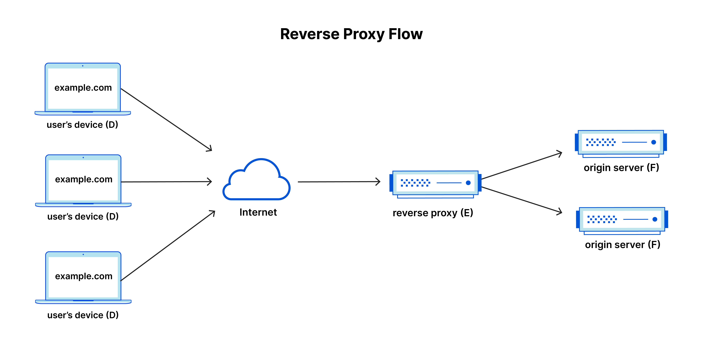

# HTTP Reverse Proxy Server

The goal of this project is to implement an HTTP reverse proxy, without the use of third-party implementations or the net/http/httputil package. The terminology used in this project is better explained using the image below where we see the functioning of a Reverse Proxy Server.

## What is Reverse Proxy?

A reverse proxy is a server, app, or cloud service that sits in front of one or more web servers and after DNS, in order to intercept and inspect incoming client requests 
before forwarding them to the web server and subsequently returning the web server’s response to the client.


source: https://www.cloudflare.com/learning/cdn/glossary/reverse-proxy/

## Project Structure

```
│── main.go             # Starting point of the application which runs both the servers concurrently
│── origin_server.go    # Implementation of the Origin Server
│── reverse_proxy.go    # Implementation of the Reverse Proxy Server
│── server_test.go      # Test suite for Origin Server and Reverse Proxy Server testing

```

## Prerequisite 
Go is required to be installed in order to run this project. Run the `go version` command to verify this.  

### How could someone get started with your codebase?

Clone the repository locally and run the following commands:
- `go install` or `go build`
- `go run .`
From a new terminal, run the following command:
- `curl -i http://localhost:8082/test` or access http://localhost:8082/test in a browser to see the response from the origin server

In order to explore this further one can deploy an application at http://localhost:8081/test and run the above curl
to test out the reverse-proxy

### Testing

Running `go test -v` helps run all the test cases in the `server_test.go`

### What resources did you use to build your implementation?
Below are the resources used:
- https://go.dev/src/net/http/client.go
- https://pkg.go.dev/net/http#hdr-Clients_and_Transports
- https://www.cloudflare.com/learning/cdn/glossary/reverse-proxy/


### Explain any design decisions you made, including limitations of the system
- Modularization:
  - I separated the code into modules (origin server, reverse proxy, main) for better readability and ease of testing.

- Using  Built-in HTTP Server with Timeouts:
  - I have set explicit read, write, and idle timeouts to protect against slow clients. 
  - This approach works well under steady conditions but might need adjustments for fluctuating traffic, and without TLS, it remains vulnerable to network attacks.

- Simple Reverse Proxy Logic:
  - The reverse proxy simply modifies and forwards requests. This can be scaled with features like caching or detailed header management.

- Centralized Error Handling with Channels:
  - I have created separate channels to handle errors from both servers and then merged into as single channel so the main function can handle failures immediately.

### How would you scale this?

The scaling of a reverse-proxy server would entail increasing its capacity to handle more incoming traffic efficiently, adding redundancy and removing single-point of failures.

- **Vertical Scaling**:
    - Spawning Goroutines: Currently this application creates goroutines per request. We can better optimize the resource allocation
      during these goroutines by using fixed-size [worker pool](https://gobyexample.com/worker-pools) goroutines to process the incoming proxy requests concurrently.
      Incoming tasks will be in a buffered channel and each worker can read from this channel to process tasks.
    - Fine-tuning resource limits like `writeTimeout`, `IdleTimeout`, `ReadTimeout` to prevent resource exhaustion

- **Horizontal Scaling**:
    - **Multiple Instances & Load Balancing:** Running multiple instances of the proxy server across different machines or containers. Using a dedicated load balancer like Nginx to distribute incoming traffic evenly. This isolates failures and allows one to scale out as needed.
    - **Service Discovery:** Implementing dynamic Service Discovery using tools like Consul or Kubernetes service discovery can help evenly distribute traffic to healthy proxy servers. They also make sure allocation nodes to incoming requests. 
    - **Deploying in an Orchestration:** Creating container images of the reverse proxy-server and deploying in a distributed environment like kubernetes can help scale this. This would also ease auto-scaling, rolling-updates and load-balancing.
    - **Efficient Load Distribution:** Kubernetes uses built-in load balancing and service discovery to route incoming requests to available reverse proxy pods. This means every request reaches a worker node running an active instance of your reverse proxy. 
    - **Scheduler Policies:** Kubernetes scheduler considers resource availability, affinity, and anti-affinity rules when placing pods across worker nodes. This ensures that your reverse proxy pods are evenly distributed across the cluster, preventing any single node from becoming a bottleneck. 
    - **High Availability and Self Recovery:** By running multiple replicas, Kubernetes ensures that if one pod or node fails, other pods can continue to handle the traffic. This leads to better fault tolerance and minimal downtime.

- **Geolocation-based routing**: 
   - Directing users to the nearest servers reduces latency and improves page load times. It distributes load efficiently across global resources while optimizing bandwidth costs by reducing long-distance data transfer.

- **Queuing Request Task** :
    - Implementing a task queue that manages incoming requests thereby preventing the server from being overwhelmed by bursts of traffic.
- **Caching and Rate Limiting**:
    - Adding a cache to store the repeated request would reduce the load and handle response rates better.
    - We can also implement rate limiting with timeouts to drop and delay requests under heavy load thereby protecting the proxy and backend servers from abuse
    - User-based rate limiting can be also implemented by using different mechanisms like integrating a per-user token bucket mechanism, identifying users by IP or API key thereby enforcing limits before forwarding requests, and optionally using a distributed store for state sharing in a horizontally scaled system.

- **Adding monitoring, health checks and Alerting** :
    - Monitoring the reverse proxy server for metrics like request volume, response times, error rates, and resource usage can help us optimize the systems
    - Based on the response volumes and error rates, we can update the [Rate Limiting parameters](https://pkg.go.dev/golang.org/x/time/rate) 
    - Health checks help actively verify the backend server availability by sending periodic test requests and automatically removing unresponsive servers from the rotation.
    - Orchestrations like Kubernetes enhances health checks by integrating them directly into the pod lifecycle using [readiness and liveness probes](https://kubernetes.io/docs/concepts/configuration/liveness-readiness-startup-probes/)
    - Alerting systems can help notify when predefined thresholds are exceeded—such as when error rate spikes, slower response times or server health checks failure

### How would you make it more secure?

In order to make the server more secure we do the following:

- **Sanitization of the incoming requests:** Validating the incoming requests to ensure it does not contain a malicious payload, such as a large string that could be used to exploit vulnerabilities (like buffer overflows)

- **HTTP Header Filtering:** Removing or sanitizing headers that could be exploited.

- **Rate-limiting and Throttling the incoming requests:** A sudden large number of incoming requests can cause a Denial of Service (DoS) attack. In order to prevent this kind of attack we need to implement
  a request task queue with timeouts to drop and delay requests under heavy load.

- **Adding Encryption:** Using TLS to encrypt all the traffic from the client to the server and from the backend to the proxy server


### What resources (including programming tool assistants) did you use to build your implementation?

The above linked resources along with the auto-generated code from GoLand IDE

